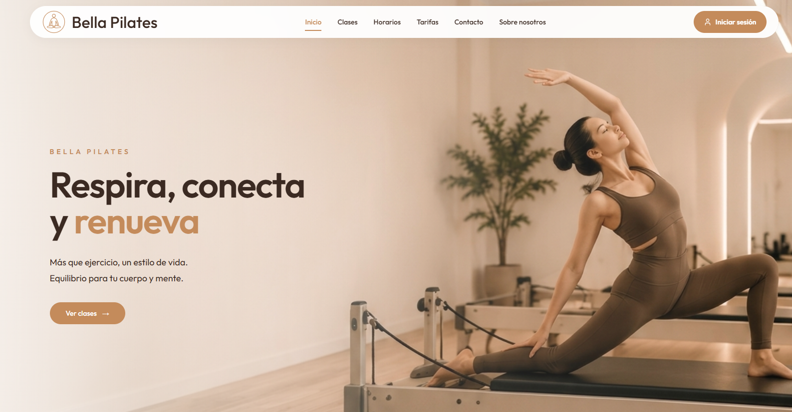
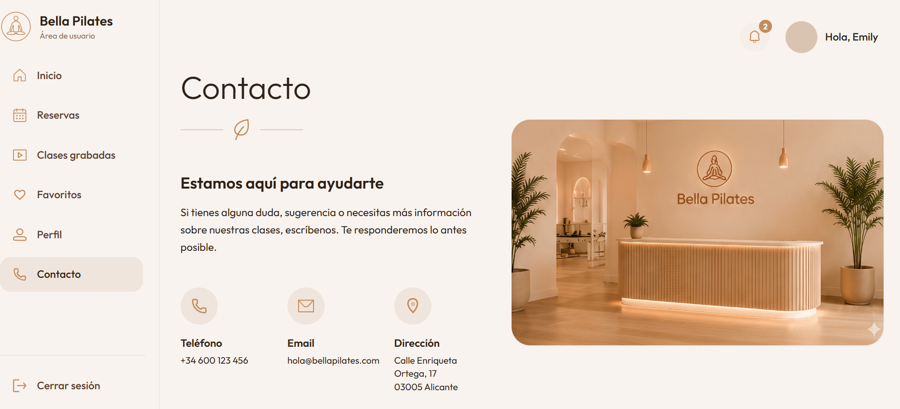
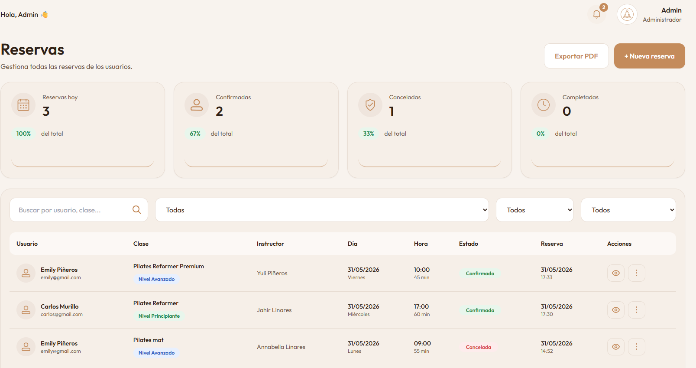
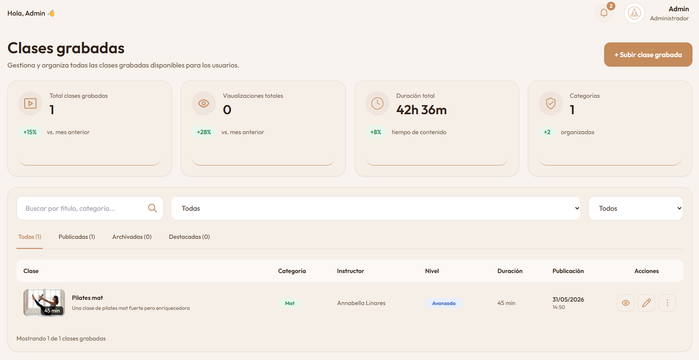
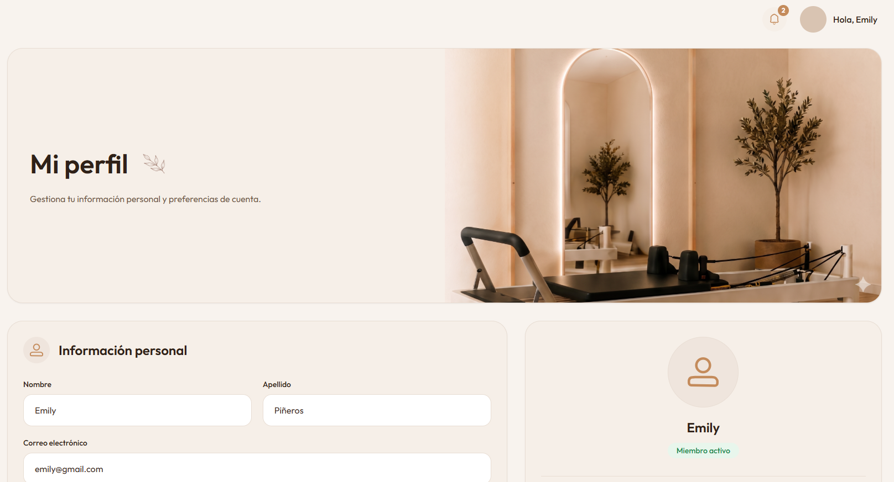
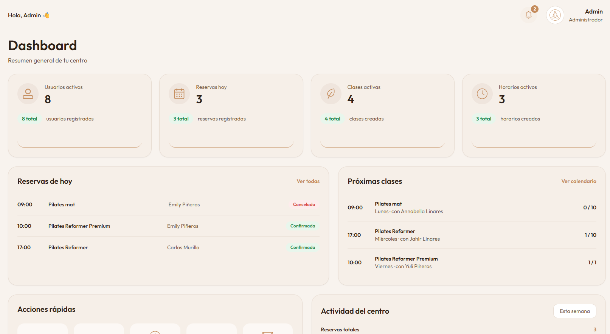

# Bella Pilates Frontend

Modern React application for **Bella Pilates**, a complete Pilates studio management platform.

## Overview

Bella Pilates is a web application that allows users to manage class reservations, access recorded classes, save favorites, manage their profile, and contact the studio.

The platform also includes a complete administration panel for managing users, classes, schedules, reservations, recorded classes, payments, messages, and business settings.

## Features

### User Area

* User authentication
* Personal dashboard
* Class reservations
* Reservation cancellation
* Recorded classes library
* Favorites management
* Profile management
* Password change
* Contact form
* Responsive design

### Admin Area

* Dashboard overview
* Users management
* Classes management
* Schedule management
* Reservations management
* Recorded classes management
* Payments management
* Messages management
* Business settings management

## Technology Stack

* React
* React Router
* Axios
* Tailwind CSS
* Vite
* JavaScript (ES6+)

## Project Structure

```txt
src/
├── assets/
├── components/
│   ├── admin/
│   ├── user/
│   └── ui/
├── pages/
│   ├── admin/
│   ├── public/
│   └── user/
├── routes/
├── services/
├── hooks/
├── utils/
└── layouts/
```

## Main Functionalities

### Authentication

* Login
* Protected routes
* Admin routes
* Session persistence

### Reservations

* View available schedules
* Create reservations
* Cancel reservations
* Reservation history

### Recorded Classes

* Browse recorded classes
* Class detail view
* Favorites integration

### Favorites

* Add recorded classes to favorites
* Remove favorites
* Quick access to saved content

### Profile

* Update personal information
* Change password
* User preferences

### Contact

* Send messages to the studio
* Admin message management

## Installation

```bash
git clone https://github.com/anna0304/bella-pilates-frontend.git

cd bella-pilates-frontend

npm install

npm run dev
```

## Environment Variables

Create a `.env` file:

```env
VITE_API_URL=http://localhost:8000/api
```

## Development Server

```bash
npm run dev
```

Default URL:

```txt
http://localhost:5173
```

## Build

```bash
npm run build
```

## Screenshots

### Home Page



### User Dashboard



### Reservations



### Recorded Classes



### Profile



### Admin Dashboard



## Screens 

### Public

* Home
* About
* Plans
* Contact
* Login

### User

* Dashboard
* Reservations
* Recorded Classes
* Favorites
* Profile
* Contact

### Admin

* Dashboard
* Users
* Classes
* Schedules
* Reservations
* Recorded Classes
* Payments
* Messages
* Settings

## Project Status

Version: 1.0

Current status:

* Frontend completed
* User flows completed
* Admin flows completed
* Responsive design implemented
* Loading states implemented
* Error states implemented
* Connected to Laravel API

## Author

Annabella Linares Molina

Full Stack Web Application developed using React, Laravel, MySQL, Tailwind CSS, and REST API architecture.


